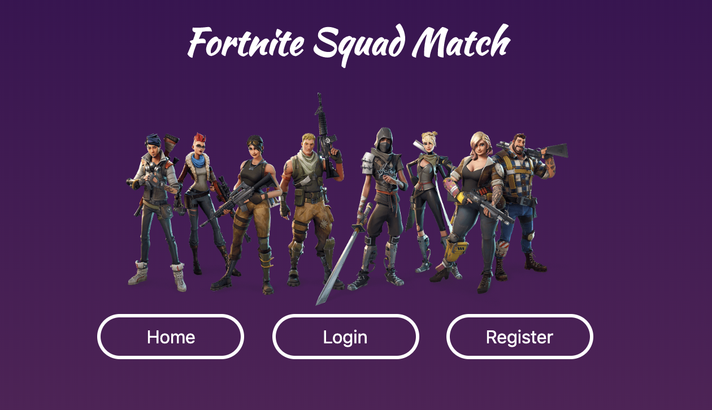

# Fortnite Squad Finder

The application will allow users to find other Fortnite players to play with

https://fierce-tundra-18202.herokuapp.com/

When the application loads for the first time, users will be able to see the existing posts made by other users in the database.

## API Documentation

### GET All Posts

```
url: '/api/posts/'
type: 'GET',
headers: {
      Authorization: `Bearer ${localStorage.getItem("token")}` <--- (Optional)
    }
```

This method gets all the posts in the database and does not require user to be logged in.

### GET Post by ID

```
url: '/api/posts/:id/'
type: 'GET',
```

Any post can be retreived using this method whether the user is logged in or not.

### GET My Posts

```
url: '/api/posts/my-posts/'
type: 'GET',
headers: {
      Authorization: `Bearer ${localStorage.getItem("token")}` <--- (Required)
    }
```

If a user is logged in, they can retrieve all of the posts they made using this method.
An authorization header is required to access this endpoint. Only the user who created the posts will be able to access this page.

### POST Show Posts by Platform

```
url: '/api/posts/:id/'
type: 'POST',
data: JSON.stringify({ platforms })
```

Retreive posts by platform by posting which platforms you're searching for.
Platforms must be an array that contains one or more of the following options: ```['pc','xb1','psn']```

### POST Register Request

```
url: '/api/users/'
type: 'POST',
data: JSON.stringify({ username, password, platform }),
contentType: "application/json"
```

Registering users requires 3 things: username, password, platform

Username

- Must be an existing username in the Epic Games network
- Usernames are case sensitive
- Some users may not be able to sign up if their Epic Games username has already been claimed
- Client will receive a validation error if the username is already taken

Password

- Minimum 8 characters
- Maximum 72 characters

Platform

- This API currently supports 3 platforms: PC, Xbox, and Playstation
- Users should choose the platform that they created their Epic Games Account with
- Users will be allowed to make posts for different platforms after registering, they just need one main platform assigned to their profile

This data will all be sent to an external API called FortniteTracker that keeps Epic user statistics and validates that the user name is an Epic username.

### POST Login Request

```
url: '/api/auth/login'
type: 'POST',
data: JSON.stringify({ username, password }),
contentType: "application/json"
```

A login request takes a username and password and returns a valid authentication token. The API uses Passport.js to authenticate user data. The username and password must be correct in order to receive the token. Each authorization token lasts 7 days. After the 7 days the user will be logged out and redirected back to the login page to create a new token.
After the method you will want to set the authorization token in the client. You can use something like this:

```
localStorage.setItem("token", data.authToken)
```

### POST Post Request

```
url: '/api/posts/'
type: 'POST',
data: JSON.stringify({ postName, platform, region, deadline, message }),
contentType: "application/json"
headers: {
      Authorization: `Bearer ${localStorage.getItem("token")}` <---- (Required)
    }
```

A post request creates a new post in the database.

- postName: Must be a string (required)
- platform: ```'pc','xb1','psn'``` (required)
- region: ```'na-east','na-west','eu'``` (required)
- deadline: Date must be > now (required)
- message: String (required)
- user: This comes from the token that you must provide in the headers after creating a user account

### DELETE Post Request

```
url: '/api/posts/my-posts/:id'
type: 'POST',
data: JSON.stringify({ _id: req.params.id }),
contentType: "application/json"
headers: {
      Authorization: `Bearer ${localStorage.getItem("token")}` <---- (Required)
    }
```

To delete a post you must have a valid token and you must pass a post id that belongs to the corresponding user. Users are only allowed to delete their own posts. You will not be able to delete the post if the user id on the token does not match the user id of the post given.

### PUT Post Request

```
url: '/api/posts/:id'
type: 'POST',
data: JSON.stringify({ id, postName, platform, region, deadline, message }),
contentType: "application/json"
headers: {
Authorization: `Bearer ${localStorage.getItem("token")}` <---- (Required)
}
```

Editing a post is similar to creating a post except that you must inlcude the id of the existing post you made. The existing post must also belong to the user that provides the token.

### PUT Reply Request

```
url: '/api/posts/reply/:id'
type: 'POST',
data: JSON.stringify({ reply }),
contentType: "application/json"
headers: {
Authorization: `Bearer ${localStorage.getItem("token")}` <---- (Required)
}
```

This method allows you to add replies to existing posts. You must be signed in but the post does not have to belong to you to add a reply. A reply consists of a datePosted (made automatically), a message, which must be a string and a user id, which is provided by the token.
